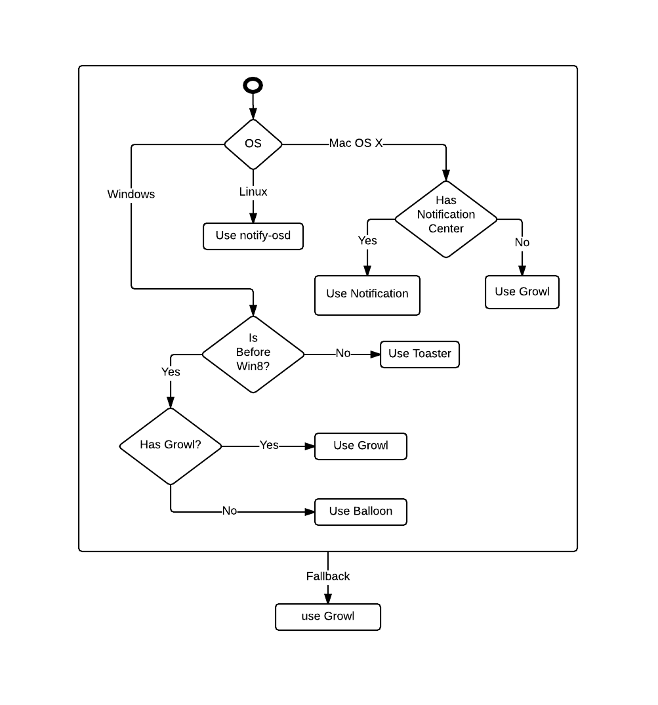

# What reporting system is used?

There are 5 different reporting systems:

* Mac Notification Center
* Linux notify-osd
* Windows Toaster
* Windows Balloons
* Growl

`node-notifier` tries to use the system that has the better
experience but prefers native solutions. This means that
Growl is prioritized over Windows Balloons (if Growl is
active).

See flow chart to see how the reporter is chosen.

